| Nama          | Nia Dwi Rahayu |
|-------------- | ---------------|
| NIM           | 312010298      |
| Kelas         | TI.20.A2       |
| Matkul        | Pemograman web |

# Pratikum 13 : Framework Lanjutan (Modul Login)

## Langkah-langkah Praktikum

### 1. Membuat Model User

Selanjutnya adalah membuat Model untuk memproses data Login. Buat file baru pada
direktori app/Models dengan nama UserModel.php

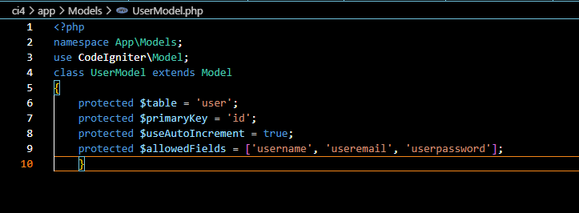

### 2. Membuat Controller User

Buat Controller baru dengan nama User.php pada direktori app/Controllers.
Kemudian tambahkan method index() untuk menampilkan daftar user, dan method
login() untuk proses login.

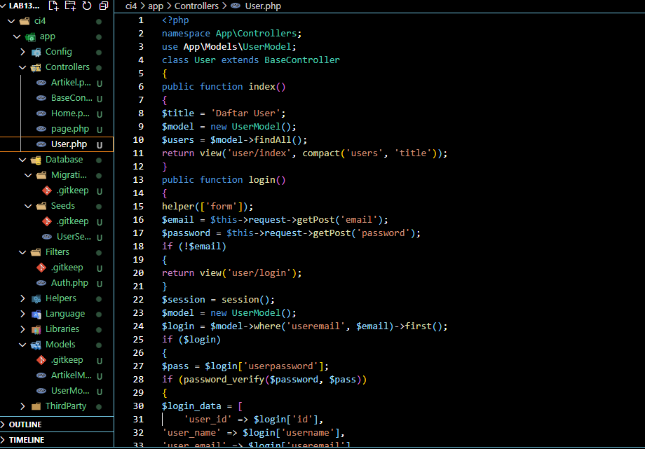

### 3. Membuat View Login

Buat direktori baru dengan nama user pada direktori app/views, kemudian buat file
baru dengan nama login.php.

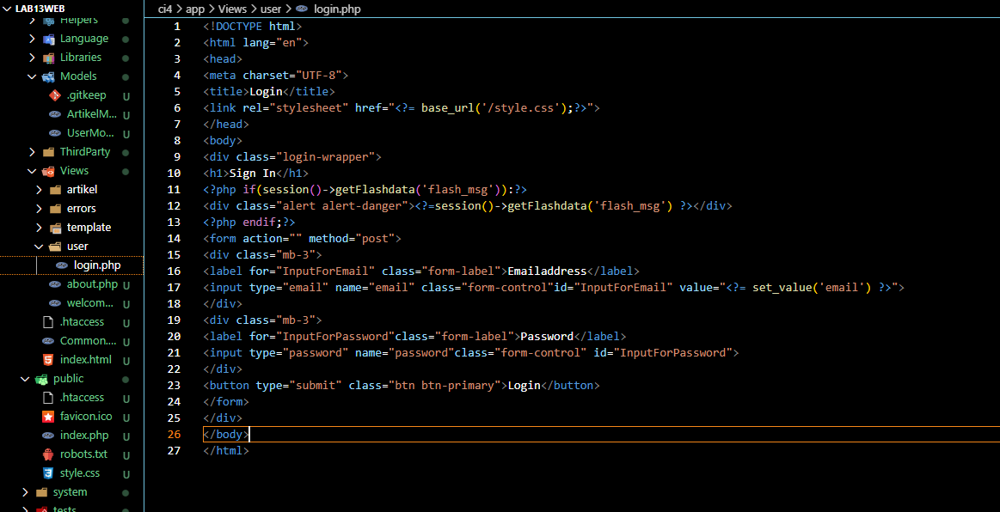

### 4. Membuat Database Seeder

Database seeder digunakan untuk membuat data dummy. Untuk keperluan ujicoba modul
login, kita perlu memasukkan data user dan password kedaalam database. Untuk itu buat
database seeder untuk tabel user. Buka CLI, kemudian tulis perintah berikut:

        php spark make:seeder UserSeeder

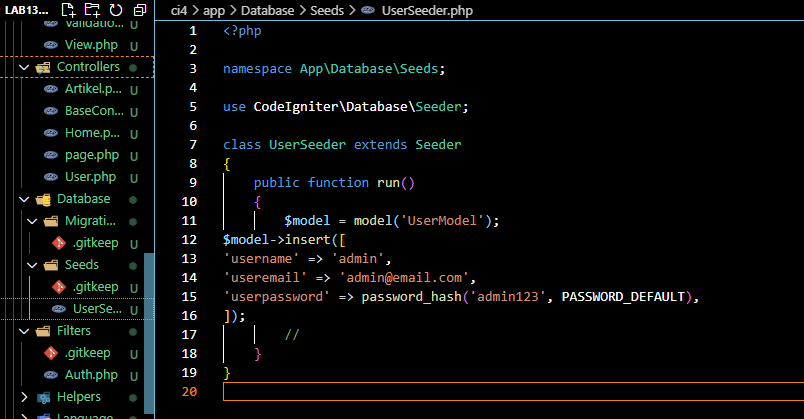

### Uji Coba Login
Selanjutnya buka url http://localhost:8080/user/login seperti berikut:

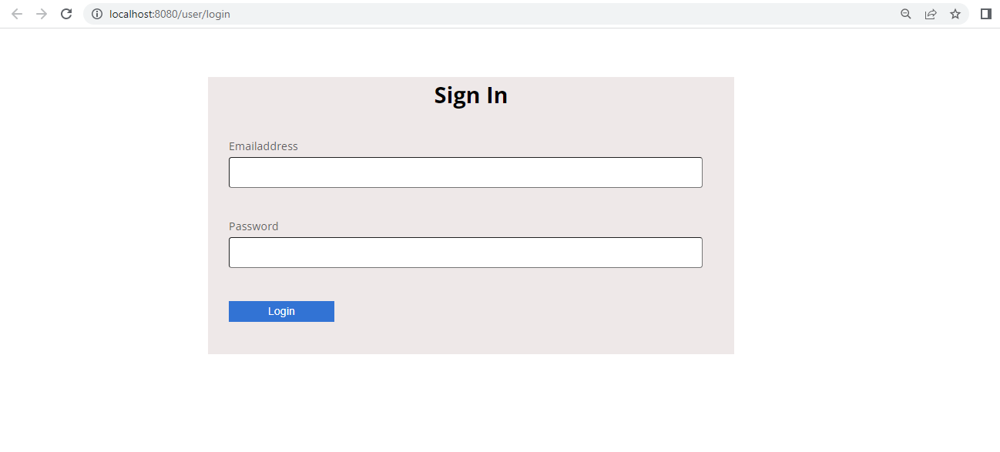

### 5. Menambahkan Auth Filter
Selanjutnya membuat filer untuk halaman admin. Buat file baru dengan nama Auth.php
pada direktori app/Filters.

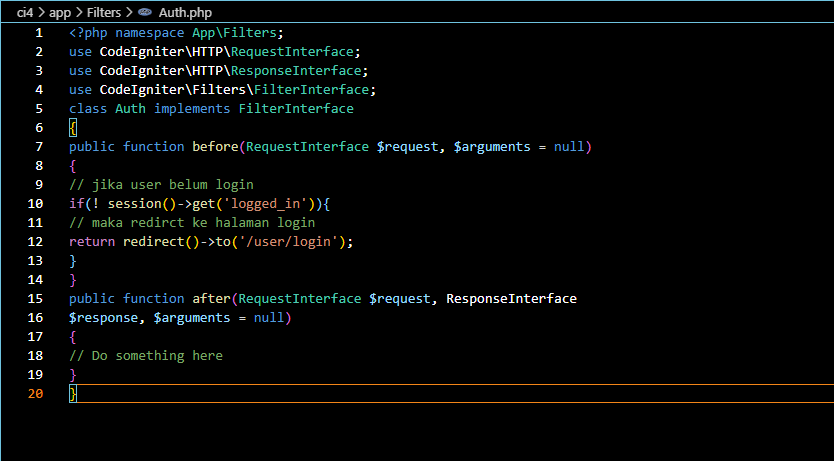

Selanjutnya buka file app/Config/Filters.php tambahkan kode berikut:
        'auth' => App\Filters\Auth::class

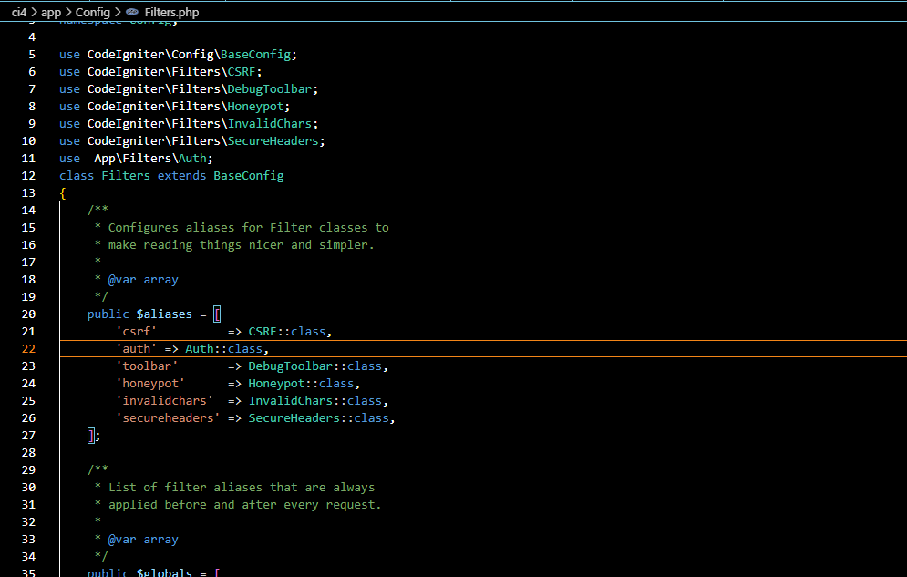

Selanjutnya buka file app/Config/Routes.php dan sesuaikan kodenya.

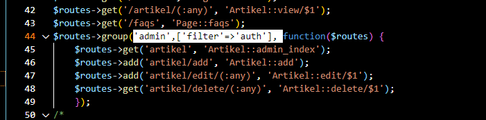

### Pertanyaan dan Tugas
Selesaikan programnya sesuai Langkah-langkah yang ada. Anda boleh melakukan improvisasi.

Membuat Tombol Home pada bagian login
pada bagian views\user\login.php tembahkan tombol untuk kembali ketampilan awal.

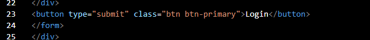

Tampilan

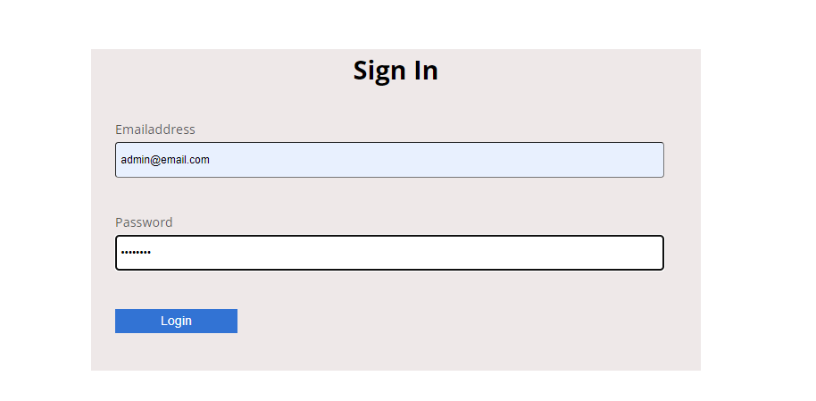

### Membuat Tombol Logout
Memberikan tombol logout pada bagian admin

Tampilan

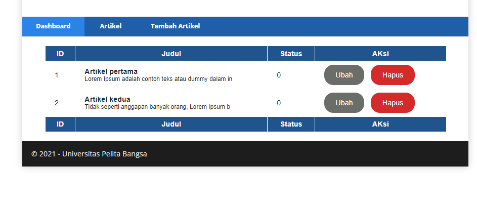